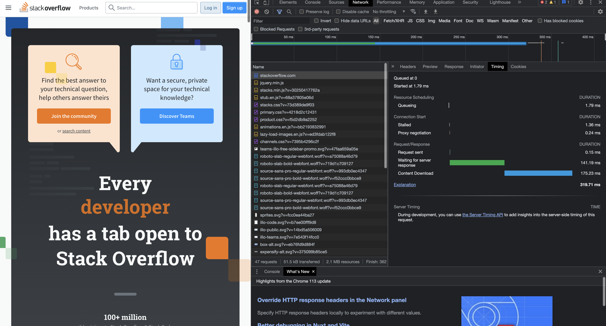

1. Работа c HTTP через telnet.

Подключитесь утилитой telnet к сайту stackoverflow.com:
telnet stackoverflow.com 80

Отправьте HTTP-запрос:
```GET /questions HTTP/1.0
HOST: stackoverflow.com
[press enter]
[press enter]
```
В ответе укажите полученный HTTP-код и поясните, что он означает.

```
HTTP/1.1 403 Forbidden
Connection: close
Content-Length: 1916
Server: Varnish
Retry-After: 0
Content-Type: text/html
Accept-Ranges: bytes
Date: Wed, 24 May 2023 21:02:01 GMT
Via: 1.1 varnish
X-Served-By: cache-ams21083-AMS
X-Cache: MISS
X-Cache-Hits: 0
X-Timer: S1684962122.958717,VS0,VE1
X-DNS-Prefetch-Control: off

<!DOCTYPE html>
<html>
<head>
    <meta http-equiv="Content-Type" content="text/html; charset=UTF-8" />
    <title>Forbidden - Stack Exchange</title>
    <style type="text/css">
		body
		{
			color: #333;
			font-family: 'Helvetica Neue', Arial, sans-serif;
			font-size: 14px;
			background: #fff url('img/bg-noise.png') repeat left top;
			line-height: 1.4;
		}
		h1
		{
			font-size: 170%;
			line-height: 34px;
			font-weight: normal;
		}
		a { color: #366fb3; }
		a:visited { color: #12457c; }
		.wrapper {
			width:960px;
			margin: 100px auto;
			text-align:left;
		}
		.msg {
			float: left;
			width: 700px;
			padding-top: 18px;
			margin-left: 18px;
		}
    </style>
</head>
<body>
    <div class="wrapper">
		<div style="float: left;">
			
		</div>
		<div class="msg">
			<h1>Access Denied</h1>
                        <p>This IP address (24.135.19.223) has been blocked from access to our services. If you believe this to be in error, please contact us at <a href="mailto:team@stackexchange.com?Subject=Blocked%2024.135.19.223%20(Request%20ID%3A%2066313508-AMS)">team@stackexchange.com</a>.</p>
                        <p>When contacting us, please include the following information in the email:</p>
                        <p>Method: block</p>
                        <p>XID: 66313508-AMS</p>
                        <p>IP: 24.135.19.223</p>
                        <p>X-Forwarded-For: </p>
                        <p>User-Agent: </p>
                        
                        <p>Time: Wed, 24 May 2023 21:02:01 GMT</p>
                        <p>URL: stackoverflow.com/questions</p>
                        <p>Browser Location: <span id="jslocation">(not loaded)</span></p>
		</div>
	</div>
	<script>document.getElementById('jslocation').innerHTML = window.location.href;</script>
</body>
</html>Connection closed by foreign host.
```

Код ответа 403 означает, что нам не разрешен доступ к ресурсу + нам вернули хтмл страницу с информацией.

2. Повторите задание 1 в браузере, используя консоль разработчика F12:

- откройте вкладку Network: правая кнопка мыши - inspect - network
- отправьте запрос http://stackoverflow.com - идем по адресу через адресную строку
- найдите первый ответ HTTP-сервера, откройте вкладку Headers - открыл
- укажите в ответе полученный HTTP-код - 200, все хорошо
- проверьте время загрузки страницы и определите, какой запрос обрабатывался дольше всего;
приложите скриншот консоли браузера в ответ.



3. Какой IP-адрес у вас в интернете?
curl ifconfig.me получили 24.135.19.223
4. Какому провайдеру принадлежит ваш IP-адрес? Какой автономной системе AS? Воспользуйтесь утилитой whois.

Получил длинный ковер с подробной информацией, но прикреплю только часть в целях безопасности)
```
OrgName:        RIPE Network Coordination Centre
OrgId:          RIPE
Address:        P.O. Box 10096
City:           Amsterdam
StateProv:      
PostalCode:     1001EB
Country:        NL
RegDate:        
Updated:        2013-07-29
Ref:            https://rdap.arin.net/registry/entity/RIPE
```

5. Через какие сети проходит пакет, отправленный с вашего компьютера на адрес 8.8.8.8? Через какие AS? Воспользуйтесь утилитой traceroute.
Вывод получил, затер данные, которые не хотел бы светить.
```
1  234234243  5.228 ms  4.682 ms  4.808 ms
 2  cable-dfdfddf (343434)  28.108 ms  28.070 ms  29.646 ms
 3  asdasd.sdasd (19.216.4.68)  21.456 ms  14.959 ms  19.711 ms
 4  dsfdsf.dsfdsf (29.216.5.18)  32.065 ms  20.641 ms
    sfgdfg (19.216.5.16)  15.628 ms
 5  122.14.219.230 (92.14.229.230)  20.845 ms
    sdfdsf (39.216.5.248)  17.075 ms  23.559 ms
 6  * * *
 7  dns.google (8.8.8.8)  31.176 ms * *
```

6. Повторите задание 5 в утилите mtr. На каком участке наибольшая задержка — delay?
Полвторил, наибольшая задержка на последнем участке.

7. 
```
dig A dns.google
8.8.4.4
8.8.8.8
```
8. Проверьте PTR записи для IP-адресов из задания 7. Какое доменное имя привязано к IP? Воспользуйтесь утилитой dig.
```
dig -x 8.8.8.8
;; global options: +cmd
;; Got answer:
;; ->>HEADER<<- opcode: QUERY, status: NOERROR, id: 38899
;; flags: qr rd ra; QUERY: 1, ANSWER: 1, AUTHORITY: 0, ADDITIONAL: 1

;; OPT PSEUDOSECTION:
; EDNS: version: 0, flags:; udp: 1232
;; QUESTION SECTION:
;8.8.8.8.in-addr.arpa.		IN	PTR

;; ANSWER SECTION:
8.8.8.8.in-addr.arpa.	77813	IN	PTR	dns.google.

;; Query time: 0 msec
;; SERVER: 1.1.1.1#53(1.1.1.1) (UDP)
;; WHEN: Wed May 24 21:25:03 UTC 2023
;; MSG SIZE  rcvd: 7

dig -x 8.8.4.4
; <<>> DiG 9.18.1-1ubuntu1.1-Ubuntu <<>> -x 8.8.4.4
;; global options: +cmd
;; Got answer:
;; ->>HEADER<<- opcode: QUERY, status: NOERROR, id: 29857
;; flags: qr rd ra; QUERY: 1, ANSWER: 1, AUTHORITY: 0, ADDITIONAL: 1

;; OPT PSEUDOSECTION:
; EDNS: version: 0, flags:; udp: 1232
;; QUESTION SECTION:
;4.4.8.8.in-addr.arpa.		IN	PTR

;; ANSWER SECTION:
4.4.8.8.in-addr.arpa.	83969	IN	PTR	dns.google.

;; Query time: 0 msec
;; SERVER: 1.1.1.1#53(1.1.1.1) (UDP)
;; WHEN: Wed May 24 21:25:46 UTC 2023
;; MSG SIZE  rcvd: 73
```

